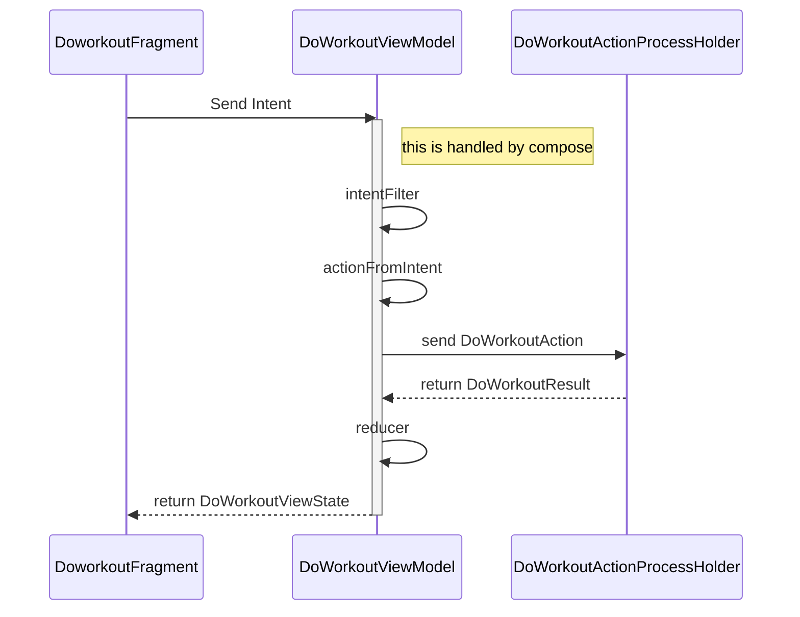

# TrackThatbarbellMobile

This is my hobby project that works at own or can be used with backend: [TracktThatBarbell](https://github.com/Aaltis/TTB)

I hope to get this released someday, possibly 2022.

---

## Architecture:

This project is to test MVI with RxJava.
Reducor and other parts that exist from activity to prosessholder is taken from:
https://github.com/oldergod/android-architecture/tree/todo-mvi-rxjava

Some ideas taken from:

Move Arcitehture taken from 
https://gofore.udemy.com/course/android-architecture/
- Separating ui from activity and making activity controller instead of separate Presenter.
- Dependence injection, separating classes to:
	- functional sets.
	- construction sets.
	this is separation of concerns

## MVI/RXJAVA in practice, DoWorkoutFragment:

---

## DONE:

MainActivity:
 - Update movements from backend if configurations are set.

DoWorkout
 - Get movements local or remote database.
 - Add excercises with sets and reps to workout.
 - Save workout local and remote database (if user is created and backend url exists).
 
 Config: 
 - Possible to create user or login existing user to backend.

## TODO:
 - Look at saved workouts
 - End To End UI Tests.
 - refactor doworkoutactivity
	- remove fragments
	- movementpickerfragment to custom dialog.
 - create workout/s from template.
 - make search for sets in history to check should you lift weight.